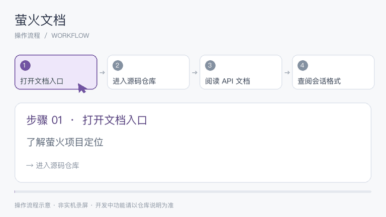

## 操作流程演示

  

[观看 / 下载完整视频](assets/demo/workflow.mp4) · [流程说明](assets/demo/workflow.json)

此 GIF 为项目对应的操作流程示意，逐步展示任务顺序；不是实机点击录屏，功能可用性以项目说明和验收状态为准。

# 萤火 / YingHuo

萤火 AI 视频生成项目文档。

- [源码仓库](https://github.com/tingman2/yinghuo-source)
