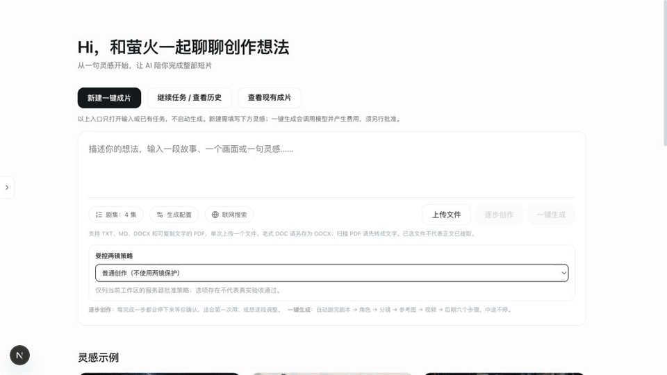

# 萤火 · YingHuo

从一句创作灵感，组织剧本、分镜与视频制作工作流。

**李思婷 · LISITING｜产品介绍、设计思路与操作演示**

## 界面操作演示

  

[观看 / 下载完整视频](assets/demo/startup.mp4) · [演示说明](assets/demo/startup.json)

实际前端配置操作，以及已有「午后的大橘」项目的剧本、角色、分镜、参考图、视频与成片浏览。配置输入和历史任务分别录制，历史成片并非本次输入生成；未重新调用付费模型。 画面按操作顺序录制，输入与阅读停留经过剪辑，不代表实际模型耗时。

## 要解决的问题

**面向人群：** 需要组织 AI 短片制作流程的创作者。

剧本、角色、分镜与媒体生成分散在不同步骤，素材引用、确认和任务状态难以集中管理。

## 产品流程

1. 选择或输入创作灵感，查看剧集与生成配置。
2. 按剧本、角色、分镜、参考图、视频、后期六个阶段组织创作。
3. 浏览已有任务，在各阶段查看结构化产物。

## 设计思路

- 阶段式工作台：把长链路拆成可理解的步骤，明确当前进度与下一步。
- 人工确认：支持逐步创作，让用户在关键阶段检查与调整。
- 产物与状态：关注素材引用、失败反馈和成片文件是否真实存在。

## 当前状态与展示范围

实际前端配置操作，以及已有「午后的大橘」项目的剧本、角色、分镜、参考图、视频与成片浏览。配置输入和历史任务分别录制，历史成片并非本次输入生成；未重新调用付费模型。

本仓库仅公开产品介绍、设计思路和演示媒体。产品源码、开发配置、数据库及内部验收资料保留在私有仓库中。

[返回李思婷的 GitHub 主页](https://github.com/tingman2) · [联系我](mailto:13167935293@163.com)
