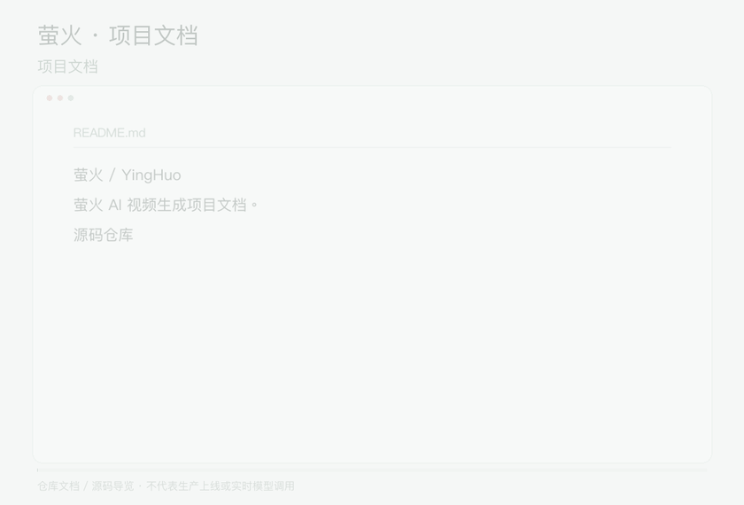

## 动态项目导览

  

[观看 / 下载完整视频](assets/demo/demo.mp4) · [素材来源](assets/demo/sources.json)

演示为仓库文档与源码的动态导览，非产品操作录屏。

# 萤火 / YingHuo

萤火 AI 视频生成项目文档。

- [源码仓库](https://github.com/tingman2/yinghuo-source)
